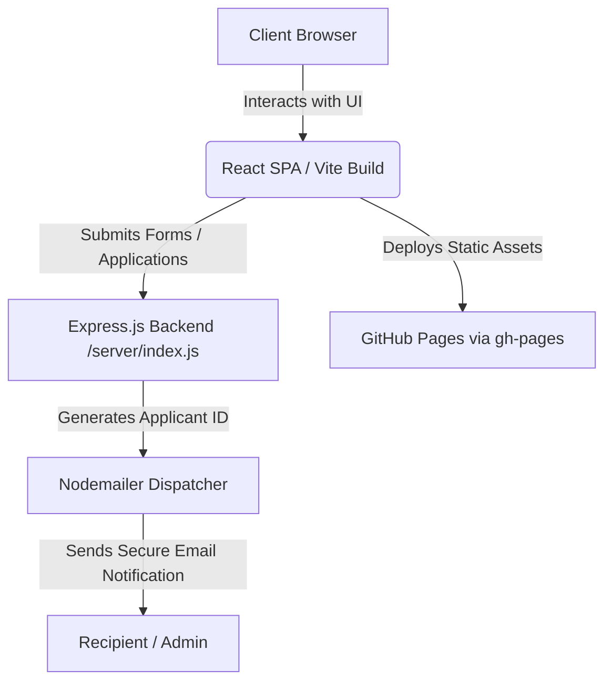

# Bavly-Hamdy/SinaiConnect

> **Enterprise-Grade Digital Infrastructure & Operations Portal** uniting high-performance React frontends with resilient Node.js microservices for secure communications, medical support workflows, and client operations.


---

## 🏷️ Shields & Ecosystem Badges

[](https://www.typescriptlang.org/)
[](https://react.dev/)
[](https://nodejs.org/)
[](https://tailwindcss.com/)
[](https://vitejs.dev/)
[](LICENSE)

---

## 📋 Table of Contents

1. [🏷️ Shields & Ecosystem Badges](#️-shields-ecosystem-badges)
2. [🔍 Overview & Architectural Intent](#-overview--architectural-intent)
3. [📌 Architecture & Workflow](#-architecture--workflow)
4. [✨ Core Features & Capabilities](#-core-features--capabilities)
5. [🛠️ Technologies & Ecosystem Matrix](#️-technologies--ecosystem-matrix)
6. [🚀 Getting Started](#-getting-started)
7. [📋 Requirements & 🚀 Installation Guide](#-requirements--installation-guide)
8. [📁 Project Structure](#-project-structure)
9. [🧩 Main Modules & Technical Breakdown](#-main-modules--technical-breakdown)
10. [🖥️ CLI & Script Execution Matrix](#️-cli--script-execution-matrix)
11. [🛡️ Security & Configuration Isolation](#️-security--configuration-isolation)
12. [🚀 Deployment & Environment Matrix](#-deployment--environment-matrix)
13. [🤝 Contributing](#-contributing)
14. [👥 Authors & Contributors](#-authors--contributors)
15. [📄 License](#-license)

---

## 🔍 Overview & Architectural Intent

`Bavly-Hamdy/SinaiConnect` is engineered as a robust enterprise platform designed to streamline secure digital engagement, customer service orchestration, and professional medical workflow facilitation. Built on a modular monolithic architecture with decoupled micro-services for asynchronous communications, the platform delivers high availability, sub-second render pipelines, and strict type safety across the entire client-server boundary.

The frontend leverages React 19 concurrent features, Vite build optimization, and Tailwind CSS 4 styling engine, integrated with Framer Motion for buttery-smooth layout transitions. The backend provides secure RESTful entry points handling job applicant screening, automated ID generation, and transactional email relay via Nodemailer with TLS hardening. 

---

## 📌 Architecture & Workflow

The system segregates client-side interaction layers from backend notification services, ensuring fault isolation and predictable state management.

```text
+-------------------------------------------------------------------+
|                           Client Layer                            |
|  [React 19 SPA] <---> [Tailwind CSS / Framer Motion UI Components]|
+-------------------------------------------------------------------+
                                  |
                                  | HTTPS / REST (JSON)
                                  v
+-------------------------------------------------------------------+
|                        Backend Micro-Service                      |
|       [Express.js API] ---> [Nodemailer Engine] ---> [SMTP]       |
+-------------------------------------------------------------------+
```

### High-Level Execution Flow



### Architecture Decision Record (ADR) & Trade-offs

| Decision Point | Chosen Technology | Alternative Considered | Trade-off / Rationale |
| :--- | :--- | :--- | :--- |
| **Frontend Framework** | React 19 + TypeScript | Vue 3 / Svelte | Maximum component ecosystem maturity, strong typing, and robust enterprise support. |
| **Styling Engine** | Tailwind CSS v4 | CSS Modules / SCSS | Rapid design iteration, zero-runtime CSS extraction, and strict token consistency. |
| **Mailer Middleware** | Node.js / Express / Nodemailer | Serverless Functions | Localized testability and direct SMTP control for enterprise mail relays. |
| **Build Tooling** | Vite v6 | Webpack | Blazing fast HMR and optimized ESM production bundling out of the box. |

---

## ✨ Core Features & Capabilities

* **Modern React Component Suite**: Modular UI blocks including Bento Grids, interactive Client Portals, dynamic Medical Services directories, and animated Mission statements.
* **Internationalization & Localization**: Built-in translation helpers (`translations-helper.js`, `utils/i18n.tsx`) supporting multilingual enterprise operations.
* **Automated Applicant Screening**: Backend server logic (`server/index.js`) for generating unique candidate IDs and dispatching formatted HTML email notifications.
* **Fluid Motion & Micro-Interactions**: Powered by Framer Motion and custom magnetic button hooks for a premium user experience.
* **Automated CI/CD Pipeline**: GitHub Actions workflows configured for rapid static asset verification and GitHub Pages staging deployment.

---

## 🛠️ Technologies & Ecosystem Matrix

| Dependency Name | Ecosystem / Category | Version | Purpose in Codebase |
| :--- | :--- | :--- | :--- |
| `react` / `react-dom` | Frontend Library | ^19.2.3 | Core UI rendering engine and DOM reconciliation. |
| `framer-motion` | Animation Engine | ^12.29.0 | Fluid component transitions and gesture animations. |
| `lucide-react` | Iconography | ^0.563.0 | Scalable vector UI icons. |
| `tailwindcss` | Styling Framework | ^4.1.18 | Utility-first CSS styling and responsive layout engine. |
| `vite` | Build Tooling | ^6.2.0 | Development server and lightning-fast bundling. |
| `express` | Backend API | ^4.x | Lightweight HTTP routing for server-side processing. |
| `nodemailer` | Email Transport | ^6.x | Secure SMTP relay for job applications and alerts. |
| `dotenv` | Configuration | ^16.x | Environment variable isolation. |

---

## 🚀 Getting Started

Follow these instructions to set up and run SinaiConnect locally for development and testing.

### Prerequisites
* **Node.js**: `v18.x` or `v20.x` LTS recommended
* **npm**: `v9.x` or higher

### Installation & Quick Start Commands

1. **Clone the Repository**:
   ```bash
   git clone https://github.com/Bavly-Hamdy/SinaiConnect.git
   cd SinaiConnect
   ```

2. **Install Frontend Dependencies**:
   ```bash
   npm install
   ```

3. **Install Backend Server Dependencies**:
   ```bash
   cd server
   npm install
   cd ..
   ```

4. **Configure Environment Variables**:
   Create a `.env` file inside the `server/` directory using the provided template:
   ```bash
   cp server/.env.example server/.env
   ```
   Update `server/.env` with your configuration details:
   ```env
   PORT=5000
   SMTP_HOST=smtp.example.com
   SMTP_PORT=587
   SMTP_USER=your-email@example.com
   SMTP_PASS=your-secure-password
   ```

5. **Run Development Services**:
   Start the frontend development server:
   ```bash
   npm run dev
   ```
   In a separate terminal, launch the backend mailer service:
   ```bash
   cd server && npm start
   ```

---

## 📋 Requirements & 🚀 Installation Guide

### Prerequisites
* **Node.js**: `v18.x` or `v20.x` LTS recommended
* **npm**: `v9.x` or higher

### Step-by-Step Installation

1. **Clone the Repository**:
   ```bash
   git clone https://github.com/Bavly-Hamdy/SinaiConnect.git
   cd SinaiConnect
   ```

2. **Install Frontend Dependencies**:
   ```bash
   npm install
   ```

3. **Install Backend Server Dependencies**:
   ```bash
   cd server
   npm install
   cd ..
   ```

4. **Configure Environment Variables**:
   Create a `.env` file inside the `server/` directory based on `server/.env.example`:
   ```env
   PORT=5000
   SMTP_HOST=smtp.example.com
   SMTP_PORT=587
   SMTP_USER=your-email@example.com
   SMTP_PASS=your-secure-password
   ```

---

## 📁 Project Structure

```text
SinaiConnect/
├── .github/
│   └── workflows/
│       └── deploy.yml            # CI/CD deployment workflow
├── assets/                       # Visual assets (Hero, Medical Support, Logo)
├── components/                   # React UI component library
│   ├── BentoGrid.tsx
│   ├── Careers.tsx
│   ├── ClientPortal.tsx
│   ├── Customized.tsx
│   ├── Footer.tsx
│   ├── Header.tsx
│   ├── Hero.tsx
│   ├── LoadingScreen.tsx
│   ├── LoginModal.tsx
│   ├── MagneticButton.tsx
│   ├── MedicalServices.tsx
│   ├── Mission.tsx
│   ├── ScrollToTop.tsx
│   ├── Solutions.tsx
│   └── Welcome.tsx
├── public/                       # Static assets and favicon
├── server/                       # Node.js / Express backend mailer service
│   ├── .env.example
│   ├── emailTemplate.js
│   ├── index.js                  # Main server entry point
│   ├── package.json
│   └── README.md
├── utils/                        # Internationalization and helper utilities
│   ├── i18n.tsx
│   └── translations-helper.js
├── App.tsx                       # Root React application layout
├── index.html                    # HTML entry point with font integrations
├── index.tsx                     # React DOM mounting script
├── package.json                  # Frontend dependencies and npm scripts
├── tsconfig.json                 # TypeScript compiler configuration
├── vite.config.ts                # Vite bundler configuration
└── PRIVACY_POLICY.md             # Enterprise compliance documentation
```

---

## 🧩 Main Modules & Technical Breakdown

### `README.md`
Provides high-level project documentation, architectural intent, features, and configuration guidelines for SinaiConnect.

### `index.html`
Serves as the main HTML template loaded by Vite, embedding Tailwind CSS configuration and external enterprise Google Fonts.

### `index.tsx`
The entry point for the React application that mounts the root `App` component into the DOM with strict mode enabled.

### `metadata.json`
Contains project metadata including application naming parameters, description, and execution frame permissions.

### `package.json`
Defines frontend project dependencies, TypeScript definitions, and scripts for development, production building, linting, and GitHub Pages deployment.

### `server/README.md`
Provides instructions for setting up, testing, and running the lightweight Node.js/Express email backend service.

### `server/index.js`
Implements an Express backend server that processes job applications, validates payload structures, generates unique applicant tracking IDs, and dispatches email notifications via Nodemailer.

### `server/package.json`
Defines backend dependencies (`express`, `cors`, `nodemailer`, `dotenv`) and npm scripts for starting the mailer service.

---

## 🖥️ CLI & Script Execution Matrix

Execute the following commands from the project root and server directories depending on your operational target:

| Target Environment | Command | Description |
| :--- | :--- | :--- |
| **Frontend Development** | `npm run dev` | Boots the Vite HMR development server for local testing. |
| **Frontend Production Build** | `npm run build` | Compiles TypeScript declarations and builds optimized static assets. |
| **Linting & Code Quality** | `npm run lint` | Runs ESLint across all TypeScript and TSX files. |
| **Preview Production Bundle** | `npm run preview` | Locally preview the production Vite build. |
| **GitHub Pages Deployment** | `npm run deploy` | Triggers predeployment build and pushes `dist/` to GitHub Pages. |
| **Backend Mailer Service** | `cd server && npm start` | Launches the Express backend notification microservice. |

---

## 🛡️ Security & Configuration Isolation

* **Environment Segregation**: Backend credentials (`SMTP_PASS`, `SMTP_USER`) are isolated within the `server/` module and loaded securely via `dotenv`. They are strictly excluded from client-side bundles.
* **Payload Validation**: The Express backend validates incoming applicant form fields before instigating SMTP relay requests, mitigating header injection vectors.
* **Static Asset Integrity**: Strict TypeScript compiler checks (`tsc`) run prior to every production build (`npm run build`) to eliminate type casting vulnerabilities.

---

## 🚀 Deployment & Environment Matrix

| Stage | Target Platform | Build Command | Configuration Source |
| :--- | :--- | :--- | :--- |
| **Development** | Localhost (`vite`) | `npm run dev` | Local `.env` overrides |
| **Staging / Demo** | GitHub Pages (`gh-pages`) | `npm run deploy` | GitHub Actions workflow (`.github/workflows/deploy.yml`) |
| **Production API** | Node.js Enterprise Host | `cd server && npm start` | Production environment variables (`.env`) |

---

## 🤝 Contributing

We welcome contributions from developers, architects, and domain experts to help improve SinaiConnect. To ensure a smooth collaboration process, please adhere to the following guidelines:

### Reporting Bugs & Requesting Features
* Use the [GitHub Issues](https://github.com/Bavly-Hamdy/SinaiConnect/issues) tracker to report bugs or suggest enhancements.
* Provide clear steps to reproduce bugs along with relevant environment details (Node version, OS, browser).

### Submitting Pull Requests
1. **Fork the Repository** and clone your fork locally.
2. **Create a Feature Branch** from `main` using a descriptive name (e.g., `git checkout -b feature/enhanced-applicant-screening`).
3. **Commit Your Changes** adhering to conventional commit messages (e.g., `feat: add biometric verification portal`, `fix: resolve SMTP relay timeout`).
4. **Run Code Quality Checks** to guarantee no regressions or lint errors exist:
   ```bash
   npm run lint
   npm run build
   ```
5. **Push to Your Fork** and open a Pull Request targeting the `main` branch of `Bavly-Hamdy/SinaiConnect`.

### Code Style & Standards
* Write clean, idiomatic **TypeScript** with explicit typing where applicable.
* Maintain consistency with existing **Tailwind CSS v4** styling patterns and component modularity.
* Ensure all new features are thoroughly tested locally before opening a pull request.

---

## 👥 Authors & Contributors

* **Bavly Hamdy** - *Lead Architect & Maintainer* - [Bavly-Hamdy](https://github.com/Bavly-Hamdy)
* **Community Contributors** - *Engineering & Documentation Support*

---

## 📄 License

This project is licensed under the **MIT License**. See the [LICENSE](LICENSE) file for complete terms and permissions.

```text
MIT License

Copyright (c) 2026 Bavly-Hamdy

Permission is hereby granted, free of charge, to any person obtaining a copy
of this software and associated documentation files (the "Software"), to deal
in the Software without restriction, including without limitation the rights
to use, copy, modify, merge, publish, distribute, sublicense, and/or sell
copies of the Software, and to permit persons to whom the Software is
furnished to do so, subject to the following conditions:

The above copyright notice and this permission notice shall be included in all
copies or substantial portions of the Software.

THE SOFTWARE IS PROVIDED "AS IS", WITHOUT WARRANTY OF ANY KIND, EXPRESS OR
IMPLIED, INCLUDING BUT NOT LIMITED TO THE WARRANTIES OF MERCHANTABILITY,
FITNESS FOR A PARTICULAR PURPOSE AND NONINFRINGEMENT. IN NO EVENT SHALL THE
AUTHORS OR COPYRIGHT HOLDERS BE LIABLE FOR ANY CLAIM, DAMAGES OR OTHER
LIABILITY, WHETHER IN AN ACTION OF CONTRACT, TORT OR OTHERWISE, ARISING FROM,
OUT OF OR IN CONNECTION WITH THE SOFTWARE OR THE USE OR OTHER DEALINGS IN THE
SOFTWARE.