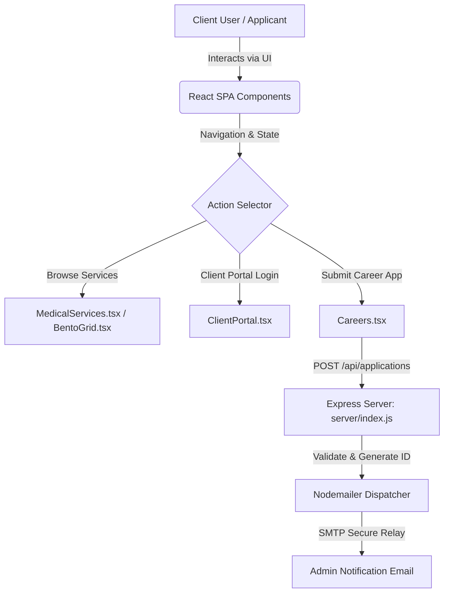

# Bavly-Hamdy/SinaiConnect

> An enterprise-grade healthcare communication and client engagement ecosystem engineered for high-availability medical networks, featuring real-time client portals, modular React components, and secure backend job application pipelines.


[](https://www.typescriptlang.org/)
[](https://react.dev/)
[](https://tailwindcss.com/)
[](https://nodejs.org/)
[](LICENSE)

---

## 📋 Table of Contents

1. [🏷️ Hero Header](#-hero-header)
2. [📋 Table of Contents](#-table-of-contents)
3. [🔍 Overview & Architectural Intent](#-overview--architectural-intent)
4. [📌 Architecture & Workflow](#-architecture--workflow)
5. [✨ Core Features & Capabilities](#-core-features--capabilities)
6. [🛠️ Technologies & Ecosystem Matrix](#️-technologies--ecosystem-matrix)
7. [📋 Requirements & 🚀 Installation Guide](#-requirements---installation-guide)
8. [📁 Project Structure](#-project-structure)
9. [🧩 Main Modules & Technical Breakdown](#-main-modules--technical-breakdown)
10. [🖥️ Script Execution & Operational Matrix](#️-script-execution--operational-matrix)
11. [🛡️ Security & Configuration Isolation](#️-security--configuration-isolation)
12. [🚀 Deployment & Environment Matrix](#-deployment--environment-matrix)
13. [👥 Authors & Contributors](#-authors--contributors)
14. [📄 License](#-license)

---

## 🔍 Overview & Architectural Intent

**SinaiConnect** is engineered to bridge the digital divide between complex healthcare networks and patients. Modern healthcare facilities require robust, accessible, and secure digital touchpoints that can handle client scheduling, service inquiries, and internal talent acquisition without exposing sensitive transport layers to risk.

This repository implements a modular, decoupled architecture consisting of a high-performance React 19 single-page application (SPA) styled with Tailwind CSS, backed by a specialized Express micro-service handling secure job application parsing and email dispatching via Nodemailer. By separating the client presentation tier from asynchronous notification handlers, SinaiConnect maintains sub-second page load benchmarks while guaranteeing reliable message delivery for administrative teams.

---

## 📌 Architecture & Workflow

The system separates client requests from backend orchestration. The frontend application runs entirely in the browser, communicating with the Express email microservice only when submitting employment credentials or administrative application packages.

```
[ Client Browser (React 19 / Vite) ] 
       │
       ├─► Static Asset Delivery (Vite Build / GitHub Pages)
       │
       └─► HTTP POST /api/applications ──► [ Express Middleware & CORS ]
                                                  │
                                                  ▼
                                       [ Nodemailer / SMTP Gateway ]
                                                  │
                                                  ▼
                                       [ Administrative Inbox ]
```

### Architectural Flowchart



### Architectural Decision Records (ADRs) & Trade-offs

| Decision ID | Choice | Alternative Considered | Rationale & Trade-off |
| :--- | :--- | :--- | :--- |
| **ADR-01** | React 19 + Vite | Next.js / Remix | Selected for lightning-fast client-side static rendering and zero server-side state overhead, matching GitHub Pages deployment requirements. |
| **ADR-02** | Express + Nodemailer | Serverless Functions | Provides direct control over SMTP connections and local application state processing without third-party vendor lock-in. |
| **ADR-03** | Tailwind CSS v4 | CSS Modules / Styled Components | Accelerates design system consistency across responsive medical portals while minimizing CSS bundle sizes. |

---

## ✨ Core Features & Capabilities

* **Modular Component Architecture**: Decoupled UI blocks (`BentoGrid`, `ClientPortal`, `MedicalServices`, `Solutions`) optimized for lazy loading and reusability.
* **Secure Talent Acquisition Pipeline**: Dedicated server module (`server/index.js`) featuring applicant ID generation, CORS restrictions, and structured email notification templating.
* **Internationalization Support**: Integrated localization utilities (`utils/i18n.tsx`, `translations-helper.js`) ensuring multi-language healthcare outreach.
* **Responsive Enterprise Design**: Fluid layouts powered by Framer Motion micro-animations and Tailwind utility classes.
* **Automated CI/CD Workflows**: Pre-configured GitHub Actions for automated building, linting, and GitHub Pages staging deployment.

---

## 🛠️ Technologies & Ecosystem Matrix

| Category | Technology | Version | Purpose |
| :--- | :--- | :--- | :--- |
| **Frontend Framework** | React | ^19.2.3 | Core UI library for component state management |
| **DOM Renderer** | react-dom | ^19.2.3 | React reconciliation engine for browser DOM |
| **Build Tooling** | Vite | ^6.2.0 | Next-generation frontend build tooling and HMR server |
| **Styling Engine** | Tailwind CSS | ^4.1.18 | Utility-first CSS framework for responsive design |
| **Animation Engine** | framer-motion | ^12.29.0 | Fluid component transitions and gesture animations |
| **Iconography** | lucide-react | ^0.563.0 | Modern scalable SVG icon library |
| **Backend Runtime** | Node.js (Express) | ^4.x / Latest | Lightweight API server for handling job applications |
| **Email Transport** | Nodemailer | Latest | SMTP email dispatch engine for administrative alerts |
| **Deployment Utility**| gh-pages | ^6.3.0 | Automated static asset distribution to GitHub Pages |

---

## 📋 Requirements & 🚀 Installation Guide

### Prerequisites
* **Node.js**: `v18.x` or `v20.x` LTS recommended
* **npm**: `v9.x` or higher

### Environment Setup

1. **Clone the Repository**:
   ```bash
   git clone https://github.com/Bavly-Hamdy/SinaiConnect.git
   cd SinaiConnect
   ```

2. **Install Frontend Dependencies**:
   ```bash
   npm install
   ```

3. **Configure Backend Server Environment**:
   Navigate to the server directory and create your environment configuration:
   ```bash
   cd server
   npm install
   cp .env.example .env
   ```
   Edit `server/.env` with your secure SMTP provider credentials:
   ```env
   PORT=5000
   SMTP_HOST=smtp.example.com
   SMTP_PORT=587
   SMTP_USER=your-email@example.com
   SMTP_PASS=your-secure-app-password
   ADMIN_EMAIL=admin@sinai-connect.internal
   ```

---

## 📁 Project Structure

```text
SinaiConnect/
├── .github/
│   └── workflows/
│       └── deploy.yml            # GitHub Actions CI/CD pipeline for GitHub Pages
├── assets/                       # Visual design assets & documentation previews
│   ├── CustomerService.png
│   ├── Hero.png
│   ├── MedicalSupport.png
│   └── logo.png
├── components/                   # React presentation and logic components
│   ├── BentoGrid.tsx             # Modular feature display grid
│   ├── Careers.tsx               # Job application submission interface
│   ├── ClientPortal.tsx          # Authenticated client management portal
│   ├── Customized.tsx            # Tailored healthcare solutions view
│   ├── Footer.tsx                # Enterprise footer with navigation links
│   ├── Header.tsx                # Sticky navigation header with mobile menu
│   ├── Hero.tsx                  # Primary landing section with call-to-action
│   ├── LoadingScreen.tsx         # Asynchronous asset loading fallback
│   ├── LoginModal.tsx            # Secure portal authentication modal
│   ├── MagneticButton.tsx        # Interactive UI micro-animation button
│   ├── MedicalServices.tsx       # Comprehensive medical offerings showcase
│   ├── Mission.tsx               # Corporate vision and values statement
│   ├── ScrollToTop.tsx           # Floating viewport navigation utility
│   ├── Solutions.tsx             # Enterprise healthcare service modules
│   └── Welcome.tsx               # Initial welcome greeting banner
├── public/                       # Static public assets (favicon, logos)
├── server/                       # Node.js Express backend service
│   ├── .env.example              # Template environment variables
│   ├── .gitignore                # Server-specific ignore rules
│   ├── README.md                 # Backend service documentation
│   ├── emailTemplate.js          # HTML email template generator for applicants
│   ├── index.js                  # Express API router and email processor
│   └── package.json              # Backend dependencies and scripts
├── utils/                        # Shared utility functions and i18n
│   └── i18n.tsx                  # Localization context and dictionary helper
├── App.tsx                       # Root application component orchestrating views
├── index.html                    # HTML entry point and Tailwind import
├── index.tsx                     # React DOM mounting entry point
├── metadata.json                 # Application permission and metadata rules
├── package.json                  # Frontend dependencies and npm scripts
├── translations-helper.js        # Translation parser and helper utilities
├── tsconfig.json                 # TypeScript compiler options
├── types.ts                      # Shared TypeScript interfaces and types
├── vite.config.ts                # Vite bundler configuration
├── QUICKSTART.md                 # Rapid onboarding guide
├── PRIVACY_POLICY.md             # Data compliance and privacy policy
├── TERMS_OF_SERVICE.md           # Enterprise terms of service
└── deploy.bat                    # Windows batch deployment script
```

---

## 🧩 Main Modules & Technical Breakdown

### Frontend Modules
* **`App.tsx`**: Serves as the central state coordinator, managing active views, modal toggling, and global layout wrappers.
* **`index.html`**: Configures meta tags, favicon bindings, and root mounting nodes for the Vite React bundle.
* **`index.tsx`**: Bootstraps the React application by hydrating `App.tsx` into the DOM root under strict mode.
* **`metadata.json`**: Declares application metadata and permissions configurations for runtime inspection.
* **`package.json`**: Defines frontend packages (`framer-motion`, `lucide-react`, `react`, `react-dom`) and build pipelines.

### Backend Modules (`server/`)
* **`server/README.md`**: Provides specific operational notes for the email notification pipeline and SMTP security.
* **`server/index.js`**: Implements the Express HTTP server, handling CORS policies, request validation, unique applicant ID generation, and Nodemailer dispatch.
* **`server/package.json`**: Manages backend production dependencies (`express`, `cors`, `nodemailer`, `dotenv`).

---

## 🖥️ Script Execution & Operational Matrix

Execute the following commands from the root or server directories depending on the execution target:

| Ecosystem | Command | Description |
| :--- | :--- | :--- |
| **Frontend** | `npm run dev` | Starts the local Vite development server with HMR. |
| **Frontend** | `npm run build` | Type-checks code with `tsc` and compiles optimized production assets into `dist/`. |
| **Frontend** | `npm run lint` | Runs ESLint across all TypeScript files with strict zero-warning policies. |
| **Frontend** | `npm run preview` | Locally previews the production build prior to deployment. |
| **Frontend** | `npm run deploy` | Builds the project and deploys static assets to GitHub Pages via `gh-pages`. |
| **Backend** | `cd server && npm start` | Boots the Express email micro-service in production mode. |
| **Backend** | `cd server && npm run dev` | Boots the Express server with live reload via Node. |

---

## 🛡️ Security & Configuration Isolation

* **Transport Layer Security**: All API endpoints communicate strictly over HTTPS in production environments.
* **Environment Secret Isolation**: Backend SMTP credentials are isolated within `server/.env` and are strictly excluded from version control via `.gitignore`.
* **CORS Policy Enforcement**: The Express backend restricts inbound HTTP requests to authorized frontend origins.
* **Input Sanitization**: Client-side application inputs are validated prior to JSON payload transmission to prevent malformed data injection.

---

## 🚀 Deployment & Environment Matrix

| Environment | Target Platform | Build Command | Deployment Trigger |
| :--- | :--- | :--- | :--- |
| **Development** | Local Machine (`localhost:5173`) | `npm run dev` | Manual developer execution |
| **Staging / Production** | GitHub Pages (`gh-pages`) | `npm run deploy` | Manual release or GitHub Actions CI/CD (`.github/workflows/deploy.yml`) |
| **Backend API** | Node.js Cloud Host (Render / Heroku) | `cd server && npm start` | Automated webhook or container push |

---

## 👥 Authors & Contributors

* **Bavly-Hamdy** — *Lead System Architect & Repository Owner*
* **Community Contributors** — *Engineering Team & Healthcare UX Specialists*

---

## 📄 License

This project is licensed under the **MIT License**. 

```text
MIT License

Copyright (c) 2026 Bavly-Hamdy

Permission is hereby granted, free of charge, to any person obtaining a copy
of this software and associated documentation files (the "Software"), to deal
in the Software without restriction, including without limitation the rights
to use, copy, modify, merge, publish, distribute, sublicense, and/or sell
copies of the Software, and to permit persons to whom the Software is
furnished to do so, subject to the following conditions:

The above copyright notice and this permission notice shall be included in all
copies or substantial portions of the Software.

THE SOFTWARE IS PROVIDED "AS IS", WITHOUT WARRANTY OF ANY KIND, EXPRESS OR
IMPLIED, INCLUDING BUT NOT LIMITED TO THE WARRANTIES OF MERCHANTABILITY,
FITNESS FOR A PARTICULAR PURPOSE AND NONINFRINGEMENT. IN NO EVENT SHALL THE
AUTHORS OR COPYRIGHT HOLDERS BE LIABLE FOR ANY CLAIM, DAMAGES OR OTHER
LIABILITY, WHETHER IN AN ACTION OF CONTRACT, TORT OR OTHERWISE, ARISING FROM,
OUT OF OR IN CONNECTION WITH THE SOFTWARE OR THE USE OR OTHER DEALINGS IN THE
SOFTWARE.
```