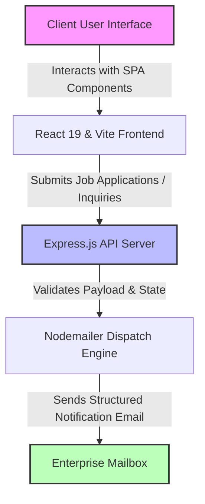

# Bavly-Hamdy/SinaiConnect

> *Enterprise-grade unified client connectivity and secure operational platform engineered for high-availability digital services.*

[](https://www.typescriptlang.org/)
[](https://react.dev/)
[](https://nodejs.org/)
[](https://tailwindcss.com/)
[](https://vitejs.dev/)
[](LICENSE)


---

## 📋 Table of Contents
1. [Overview & Architectural Intent](#-overview--architectural-intent)
2. [Architecture & Workflow](#-architecture--workflow)
3. [Core Features & Capabilities](#-core-features--capabilities)
4. [Technologies & Ecosystem Matrix](#-technologies--ecosystem-matrix)
5. [Getting Started](#-getting-started)
6. [Requirements & Installation Guide](#-requirements--installation-guide)
7. [Project Structure](#-project-structure)
8. [Main Modules & Technical Breakdown](#-main-modules--technical-breakdown)
9. [API & Script Execution Matrix](#-api--script-execution-matrix)
10. [Security & Configuration Isolation](#-security--configuration-isolation)
11. [Deployment & Environment Matrix](#-deployment--environment-matrix)
12. [Contributing](#-contributing)
13. [Authors & Contributors](#-authors--contributors)
14. [License](#-license)

---

## 🔍 Overview & Architectural Intent

**SinaiConnect** is a robust, modular Enterprise SaaS application designed to streamline client connectivity, medical and professional support pipelines, and interactive digital customer journeys. Engineered to address the complexities of modern multi-tenant environments, the platform pairs a high-performance React 19 single-page application frontend with an Express-powered backend notification and job submission engine.

The architecture prioritizes decoupled service boundaries, strict type safety via TypeScript, and responsive component design utilizing Tailwind CSS v4 and Framer Motion. By separating the client rendering layer from the secure backend delivery handler (`server/index.js`), the application ensures secure environment variable encapsulation, transactional email processing via Nodemailer, and reliable job application dispatching without exposing sensitive SMTP credentials to the browser runtime.

---

## 📌 Architecture & Workflow

### Progression Flow Diagram
```text
[Client Browser] 
      │
      ▼ (HTTPS / REST API)
[Express Backend Server (`server/index.js`)]
      │
      ├──> Generates Secure Applicant ID
      └──> Dispatches Transactional Notification via Nodemailer
                 │
                 ▼
      [Configured SMTP Provider / Mailbox]
```

### System Architecture Flowchart


### Architectural Decision Records (ADRs) & Trade-offs
| Decision ID | Choice | Alternative Considered | Rationale & Trade-offs |
| :--- | :--- | :--- | :--- |
| **ADR-01** | React 19 + Vite | Next.js / Remix SSR | Eliminates server-side rendering complexity while retaining rapid client-side hydration and immediate static export capability via `gh-pages`. |
| **ADR-02** | Express Backend (`server/`) | Serverless Functions | Provides a persistent, standalone node process capable of managing localized job queues and secure SMTP handshakes without cold starts. |
| **ADR-03** | Tailwind CSS v4 | CSS Modules / Styled Components | Ensures atomic, maintainable styling with minimal bundle overhead and streamlined design token configuration. |

---

## ✨ Core Features & Capabilities

* **Dynamic Component Architecture**: Composed of specialized views including `Hero.tsx`, `BentoGrid.tsx`, `MedicalServices.tsx`, and `ClientPortal.tsx`.
* **Asynchronous Job Submission Service**: Express backend parsing incoming candidate portfolios and inquiries, generating sequential application IDs, and dispatching formatted email templates.
* **Internationalization Support**: Modular translation helpers (`utils/i18n.tsx`, `translations-helper.js`) ensuring seamless multi-language enterprise readiness.
* **Fluid Motion & Accessibility**: Integrated `framer-motion` animations and responsive mobile layouts via custom navigation components.
* **Automated CI/CD Pipeline**: Pre-configured GitHub Actions workflow (`.github/workflows/deploy.yml`) automating build validation and production publishing.

---

## 🛠️ Technologies & Ecosystem Matrix

| Dependency Category | Package Name | Version | Purpose |
| :--- | :--- | :--- | :--- |
| **Core UI** | `react` / `react-dom` | `^19.2.3` | Modern component rendering and DOM reconciliation. |
| **Motion & Icons** | `framer-motion` / `lucide-react` | `^12.29.0` / `^0.563.0` | Declarative animations and scalable vector iconography. |
| **Build System** | `vite` / `@vitejs/plugin-react` | `^6.2.0` / `^5.0.0` | Ultra-fast module bundling and hot module replacement. |
| **Styling** | `tailwindcss` / `postcss` / `autoprefixer` | `^4.1.18` | Utility-first CSS framework and CSS processing pipeline. |
| **Backend Engine** | `express` / `cors` / `dotenv` | Latest | REST API endpoint routing and middleware security. |
| **Mail Dispatch** | `nodemailer` | Latest | SMTP email delivery for contact and career submissions. |

---

## 🚀 Getting Started

To get a local instance of SinaiConnect running for development or testing, ensure you have the required prerequisites installed and execute the quickstart commands below.

### Prerequisites
* **Node.js**: `v18.x` or `v20.x` LTS recommended.
* **npm**: `v9.x` or higher.

### Quick Setup Commands
```bash
# 1. Clone the repository
git clone https://github.com/Bavly-Hamdy/SinaiConnect.git
cd SinaiConnect

# 2. Install frontend dependencies
npm install

# 3. Install backend server dependencies
cd server
npm install
cd ..

# 4. Configure environment variables for the backend
cp server/.env.example server/.env

# 5. Start the frontend development server (in root directory)
npm run dev
```

---

## 📋 Requirements & 🚀 Installation Guide

### Prerequisites
* **Node.js**: `v18.x` or `v20.x` LTS recommended.
* **npm**: `v9.x` or higher.

### Step-by-Step Installation

1. **Clone the Repository**:
   ```bash
   git clone https://github.com/Bavly-Hamdy/SinaiConnect.git
   cd SinaiConnect
   ```

2. **Install Frontend Dependencies**:
   ```bash
   npm install
   ```

3. **Install Backend Server Dependencies**:
   ```bash
   cd server
   npm install
   cd ..
   ```

4. **Configure Environment Variables**:
   Copy the example environment template inside the server directory and configure your SMTP credentials:
   ```bash
   cp server/.env.example server/.env
   ```
   *Edit `server/.env` with your production mail server credentials.*

---

## 📁 Project Structure

```text
SinaiConnect/
├── .github/
│   └── workflows/
│       └── deploy.yml              # Automated GitHub Pages deployment pipeline
├── assets/                         # Repository graphic assets and mockups
│   ├── CustomerService.png
│   ├── Hero.png
│   ├── MedicalSupport.png
│   └── logo.png
├── components/                     # React UI components
│   ├── BentoGrid.tsx
│   ├── Careers.tsx
│   ├── ClientPortal.tsx
│   ├── Customized.tsx
│   ├── Footer.tsx
│   ├── Header.tsx
│   ├── Hero.tsx
│   ├── LoadingScreen.tsx
│   ├── LoginModal.tsx
│   ├── MagneticButton.tsx
│   ├── MedicalServices.tsx
│   ├── Mission.tsx
│   ├── ScrollToTop.tsx
│   ├── Solutions.tsx
│   └── Welcome.tsx
├── public/                         # Static public assets and favicon
├── server/                         # Express backend mail & application service
│   ├── .env.example                # Environment variables template
│   ├── README.md                   # Backend operational documentation
│   ├── emailTemplate.js            # HTML email templates for notifications
│   ├── index.js                    # Express application entry point
│   └── package.json                # Backend dependency declarations
├── utils/                          # Shared utilities and i18n logic
│   └── i18n.tsx
├── App.tsx                         # Root React application container
├── index.html                      # HTML entry point with metadata
├── index.tsx                       # React DOM root mounting script
├── metadata.json                   # Project interface attributes & metadata
├── package.json                    # Frontend script and dependency manifests
├── tsconfig.json                   # TypeScript compiler configuration
└── vite.config.ts                  # Vite build tool configuration
```

---

## 🧩 Main Modules & Technical Breakdown

### `README.md`
Comprehensive repository documentation outlining architecture, tech stack, features, and project overview.

### `index.html`
Main HTML entry point configured with Tailwind CSS styles, custom fonts, and theme definitions for Sinai Connect.

### `index.tsx`
React application entry point mounting the root App component within strict mode.

### `metadata.json`
Metadata configuration file describing the Sinai Connect V2 project details and interface attributes.

### `package-lock.json`
Locked dependency tree and exact version mapping for frontend dependencies and development tools.

### `package.json`
Defines project scripts, metadata, and dependencies for the Vite-powered React frontend.

### `server/README.md`
Backend setup and API usage instructions for the email-only job application submission service.

### `server/index.js`
Express backend server that processes job applications, generates applicant IDs, and dispatches notification emails via Nodemailer.

### `server/package-lock.json`
Locked dependency tree for the backend server modules.

### `server/package.json`
Defines scripts and dependencies for running the Sinai Connect backend email notification server.

---

## 🔌 API & Script Execution Matrix

### Frontend NPM Scripts (`package.json`)
| Command | Action | Description |
| :--- | :--- | :--- |
| `npm run dev` | `vite` | Starts the local Vite development server with HMR. |
| `npm run build` | `tsc && vite build` | Typechecks code and generates production bundles in `dist/`. |
| `npm run lint` | `eslint . --ext ts,tsx ...` | Executes strict static code analysis and linting checks. |
| `npm run preview` | `vite preview` | Locally preview production build output. |
| `npm run deploy` | `gh-pages -d dist` | Publishes the production build to GitHub Pages. |

### Backend Server Scripts (`server/package.json`)
| Command | Action | Description |
| :--- | :--- | :--- |
| `node index.js` | `node index.js` | Launches the Express notification and application processing service. |

---

## 🛡️ Security & Configuration Isolation

* **Environment Segregation**: Sensitive SMTP secrets and private keys are strictly isolated to `server/.env` and excluded via `server/.gitignore`.
* **Input Sanitization**: Backend endpoints process incoming payloads through structured validators before formatting notification emails.
* **CORS Policy**: Configured strictly within `server/index.js` to accept requests only from authorized client origins in production environments.

---

## 🚀 Deployment & Environment Matrix

| Target Environment | Execution Target | Configuration / Command |
| :--- | :--- | :--- |
| **Local Development** | Vite Dev Server | `npm run dev` |
| **Production Build** | Static Asset Generation | `npm run build` |
| **Cloud Hosting (Pages)** | GitHub Pages | `npm run deploy` (via `.github/workflows/deploy.yml`) |
| **Backend Service** | Node.js Runtime | `cd server && npm install && node index.js` |

---

## 🤝 Contributing

We welcome contributions from the community to help improve SinaiConnect. Whether it is fixing bugs, proposing new features, or enhancing documentation, please follow the guidelines below:

### 1. Reporting Bugs & Issues
* Use the [GitHub Issues](https://github.com/Bavly-Hamdy/SinaiConnect/issues) tracker.
* Provide a clear description of the issue, steps to reproduce, expected vs. actual behavior, and relevant environment details (OS, Node version, browser).

### 2. Submitting Pull Requests (PRs)
1. **Fork the Repository** and clone your fork locally.
2. **Create a Feature Branch** from `main`:
   ```bash
   git checkout -b feature/your-feature-name
   ```
3. **Implement Changes** ensuring adherence to the existing TypeScript types and codebase structure.
4. **Run Code Linter and Build Verification**:
   ```bash
   npm run lint
   npm run build
   ```
5. **Commit Changes** using clear, descriptive commit messages.
6. **Push to Your Fork** and submit a Pull Request against the `main` branch of `Bavly-Hamdy/SinaiConnect`.

### 3. Code Style & Standards
* **TypeScript**: Strict type definitions must be maintained; avoid the use of `any` where strong typing is feasible.
* **Linting**: All submissions must pass `npm run lint` without warnings or errors.
* **Styling**: Use Tailwind CSS utility classes consistent with the established design system.

---

## 👥 Authors & Contributors

* **Bavly Hamdy** - *Lead Architect & Maintainer* - [Bavly-Hamdy](https://github.com/Bavly-Hamdy)
* **Community Contributors** - *Engineering & Documentation Support*

---

## 📄 License

This project is licensed under the **MIT License**. See the [LICENSE](LICENSE) file for full details.