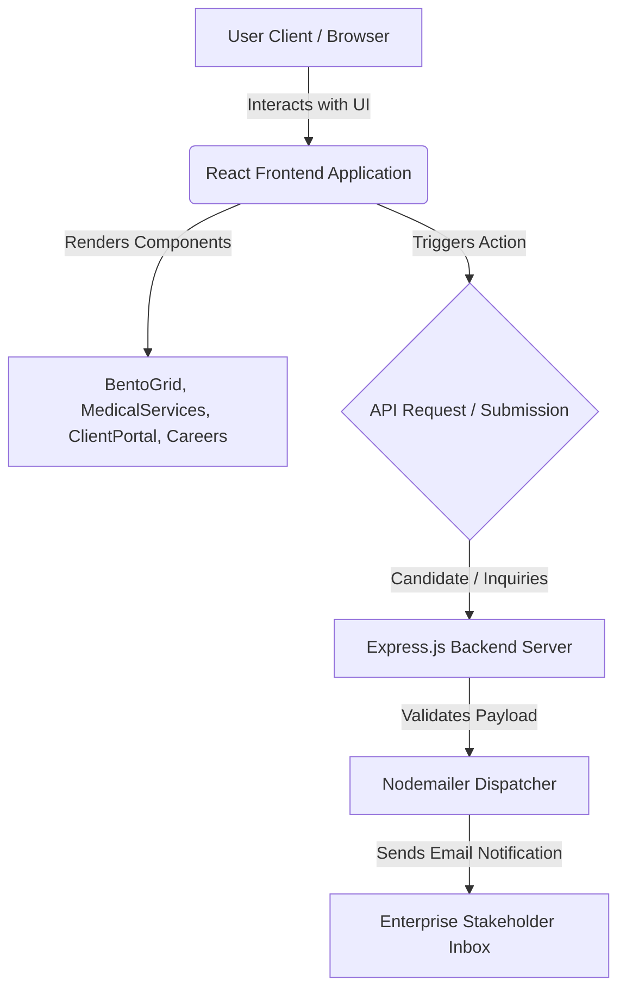

# Bavly-Hamdy/SinaiConnect

<p align="center">
  <b>An enterprise-grade, high-performance client portal and medical services integration platform engineered for robust communication, automated dispatch workflows, and responsive cross-device deployment.</b>
</p>

<p align="center">
  
  
  
  
  
  
</p>


---

## 📋 Table of Contents
1. [🏷️ Hero Header](#-hero-header)
2. [📋 Table of Contents](#-table-of-contents)
3. [🔍 Overview & Architectural Intent](#-overview--architectural-intent)
4. [📌 Architecture & Workflow](#-architecture--workflow)
5. [✨ Core Features & Capabilities](#-core-features--capabilities)
6. [🛠️ Technologies & Ecosystem Matrix](#️-technologies--ecosystem-matrix)
7. [🚀 Getting Started](#-getting-started)
8. [📋 Requirements & Installation Guide](#-requirements--installation-guide)
9. [📁 Project Structure](#-project-structure)
10. [🧩 Main Modules & Technical Breakdown](#-main-modules--technical-breakdown)
11. [🔌 API Reference & Script Execution Matrix](#-api-reference--script-execution-matrix)
12. [🛡️ Security & Configuration Isolation](#️-security--configuration-isolation)
13. [🚀 Deployment & Environment Matrix](#-deployment--environment-matrix)
14. [🤝 Contributing](#-contributing)
15. [👥 Authors & Contributors](#-authors--contributors)
16. [📄 License](#-license)

---

## 🔍 Overview & Architectural Intent

**SinaiConnect** is built to solve the modern enterprise challenge of unifying client service portals, specialized medical support triage, and streamlined career application workflows into a cohesive, lightning-fast web experience. Built with a decoupled frontend-backend architecture, the platform guarantees zero blocking on the UI thread while ensuring reliable server-side transactional email processing and secure candidate tracking.

The design motivation centers on extreme modularity, type safety via TypeScript, and an adaptable component layout styled with Tailwind CSS v4. Whether navigating client service hubs or submitting medical support inquiries, users benefit from hardware-accelerated animations powered by Framer Motion and an intuitive multilingual translation helper utility.

---

## 📌 Architecture & Workflow

The system architecture cleanly separates the single-page client interface from the backend email dispatch server, ensuring resilient error isolation and straightforward horizontal scaling.

### Progression Flow Diagram
```text
[ Client Browser / React SPA ] 
       │
       ├── User Interaction (BentoGrid, ClientPortal, MedicalServices)
       ├── State Management & Localization (i18n.tsx)
       │
       ▼ (HTTP POST / Job Submission)
[ Express Backend Server (server/index.js) ]
       │
       ├── Unique ID Generation & Template Assembly (server/emailTemplate.js)
       ├── Secure SMTP Handshake via Nodemailer
       │
       ▼
[ External Notification Destination ]
```

### System Architecture Flowchart


### Architecture Decision Records (ADRs) & Trade-offs
| Decision ID | Choice | Alternative Considered | Trade-off / Rationale |
| :--- | :--- | :--- | :--- |
| **ADR-01** | React 19 + Vite SPA | Next.js SSR / Remix | Selected for optimal static hosting portability (`gh-pages`) and zero-latency client interactions while maintaining robust TypeScript definitions. |
| **ADR-02** | Express + Nodemailer Backend | Serverless Functions | Provides an independent, easily containerized micro-service for handling asynchronous applicant emails with absolute control over SMTP timeouts. |
| **ADR-03** | Tailwind CSS v4 | CSS Modules / Styled Components | Delivers rapid styling consistency and zero runtime CSS overhead across complex responsive layouts. |

---

## ✨ Core Features & Capabilities

* **Interactive Bento Grid Layout:** High-density feature presentation organizing solutions and client portals cleanly across viewports.
* **Specialized Medical Support Modules:** Dedicated workflows and UI components (`MedicalServices.tsx`, `MedicalSupport.png`) tailored for healthcare inquiries.
* **Dynamic Careers Application Pipeline:** End-to-end applicant form handling integrated with a dedicated Node.js/Express backend that generates unique application IDs and rich HTML email notifications.
* **Fluid Motion Engineering:** Seamless transitions and UI feedback loops driven by `framer-motion` and custom magnetic button primitives.
* **Internationalization (i18n) Utility:** Built-in localization support (`translations-helper.js`, `utils/i18n.tsx`) allowing effortless expansion into multiple linguistic markets.
* **Automated Deployment Pipeline:** GitHub Actions workflow pre-configured for automated build verification and deployment to GitHub Pages via `gh-pages`.

---

## 🛠️ Technologies & Ecosystem Matrix

| Category | Technology / Package | Version | Purpose |
| :--- | :--- | :--- | :--- |
| **Frontend Framework** | `react` / `react-dom` | ^19.2.3 | Core UI rendering library |
| **Build Tooling** | `vite` / `@vitejs/plugin-react` | ^6.2.0 | Ultra-fast Hot Module Replacement (HMR) and bundling |
| **Styling Engine** | `tailwindcss` / `autoprefixer` / `postcss` | ^4.1.18 | Utility-first CSS framework and vendor prefixing |
| **Animation Library** | `framer-motion` | ^12.29.0 | Hardware-accelerated component animations |
| **Iconography** | `lucide-react` | ^0.563.0 | Scalable vector UI icons |
| **Language** | `typescript` | ~5.8.2 | Static typing and interface contracts |
| **Backend Server** | `express` / `cors` / `dotenv` | Latest | API routing, CORS configuration, and environment isolation |
| **Email Dispatch** | `nodemailer` | Latest | SMTP email transport and template rendering |
| **Deployment** | `gh-pages` | ^6.3.0 | Static asset publication to GitHub Pages |

---

## 🚀 Getting Started

Get up and running with SinaiConnect locally by cloning the repository and setting up both the frontend client and the backend email service.

### Prerequisites
* **Node.js**: `v18.x` or `v20.x` LTS recommended
* **npm**: `v9.x` or higher

### Installation Commands

1. **Clone the repository:**
   ```bash
   git clone https://github.com/Bavly-Hamdy/SinaiConnect.git
   cd SinaiConnect
   ```

2. **Install Frontend Client Dependencies:**
   ```bash
   npm install
   ```

3. **Install Backend Server Dependencies:**
   ```bash
   cd server
   npm install
   cd ..
   ```

4. **Configure Environment Variables:**
   Create a `.env` file inside the `server/` directory based on `server/.env.example`:
   ```env
   PORT=5000
   SMTP_HOST=smtp.example.com
   SMTP_PORT=587
   SMTP_USER=your-email@example.com
   SMTP_PASS=your-secure-password
   RECEIVER_EMAIL=admin@sinai-connect.com
   ```

5. **Run the Application:**
   * **Start Frontend Development Server:**
     ```bash
     npm run dev
     ```
   * **Start Backend Server:**
     ```bash
     cd server
     npm start
     ```

---

## 📋 Requirements & Installation Guide

### System Requirements
* Operating System: Linux, macOS, or Windows (with WSL2 recommended)
* Memory: Minimum 4GB RAM for running Vite dev server and Node.js concurrently

---

## 📁 Project Structure

```text
SinaiConnect/
├── .github/
│   └── workflows/
│       └── deploy.yml              # GitHub Actions CI/CD deployment pipeline
├── assets/                         # Design assets and preview images
│   ├── CustomerService.png
│   ├── Hero.png
│   ├── MedicalSupport.png
│   └── logo.png
├── components/                     # React UI components
│   ├── BentoGrid.tsx
│   ├── Careers.tsx
│   ├── ClientPortal.tsx
│   ├── Customized.tsx
│   ├── Footer.tsx
│   ├── Header.tsx
│   ├── Hero.tsx
│   ├── LoadingScreen.tsx
│   ├── LoginModal.tsx
│   ├── MagneticButton.tsx
│   ├── MedicalServices.tsx
│   ├── Mission.tsx
│   ├── ScrollToTop.tsx
│   ├── Solutions.tsx
│   └── Welcome.tsx
├── public/                         # Static public assets and favicon
├── server/                         # Node.js Express backend
│   ├── .env.example
│   ├── emailTemplate.js            # HTML email generator for job applications
│   ├── index.js                    # Express server entry point & email router
│   ├── package.json
│   └── README.md
├── utils/                          # Helper functions and localization
│   └── i18n.tsx
├── App.tsx                         # Root React application layout
├── index.html                      # HTML entry point with Tailwind styling
├── index.tsx                       # React DOM mounting script
├── metadata.json                   # App title and permissions configuration
├── package.json                    # Frontend dependencies and scripts
├── tsconfig.json                   # TypeScript compiler configuration
└── vite.config.ts                  # Vite build tool configuration
```

---

## 🧩 Main Modules & Technical Breakdown

### `README.md`
Comprehensive repository documentation detailing architecture, workflow, core features, and setup guidelines.

### `index.html`
Main HTML entry point configured with Tailwind CSS styling, Google Fonts integrations, and brand-aligned meta tags.

### `index.tsx`
React DOM mounting script that binds the root application wrapper (`<App />`) to the document DOM.

### `metadata.json`
Metadata configuration defining application title, description, and permissions.

### `package.json`
Defines client-side project scripts (`dev`, `build`, `lint`, `preview`, `deploy`) and third-party dependencies (`react`, `framer-motion`, `lucide-react`).

### `server/README.md`
Backend-specific documentation detailing quick-start instructions, environment variables, and SMTP configuration guidelines.

### `server/index.js`
Express server entry point providing email-only job application processing and unique ID generation using Nodemailer with robust CORS handling.

### `server/package.json`
Defines scripts and dependencies (`express`, `nodemailer`, `cors`, `dotenv`) for the backend email-dispatch server.

---

## 🔌 API Reference & Script Execution Matrix

### Frontend NPM Scripts
| Command | Action | Description |
| :--- | :--- | :--- |
| `npm run dev` | `vite` | Launches local Vite development server with HMR. |
| `npm run build` | `tsc && vite build` | Typechecks code via TypeScript compiler and generates production bundle in `dist/`. |
| `npm run lint` | `eslint . --ext ts,tsx ...` | Executes static code analysis and enforces strict lint rules. |
| `npm run preview` | `vite preview` | Locally preview the production build before deployment. |
| `npm run deploy` | `gh-pages -d dist` | Publishes the built static site to GitHub Pages. |

### Backend API Endpoints (`server/index.js`)
| Method | Endpoint | Description | Request Body Example |
| :--- | :--- | :--- | :--- |
| `POST` | `/api/apply` | Receives candidate job application data, generates a unique application ID, and dispatches an HTML email notification. | `{ "name": "Jane Doe", "email": "jane@example.com", "position": "Developer", "resume": "..." }` |
| `GET` | `/health` | Server health check endpoint ensuring backend operational readiness. | `{}` |

---

## 🛡️ Security & Configuration Isolation

* **Environment Secret Segregation:** Backend credentials (`SMTP_PASS`, `SMTP_USER`) are strictly isolated within the `server/.env` configuration file and excluded via `.gitignore` to prevent secret leakage.
* **CORS Policy Enforcement:** The Express server implements explicit Cross-Origin Resource Sharing restrictions to guarantee that only authorized frontend origins can trigger API submissions.
* **Input Validation & Sanitization:** All incoming candidate payloads and contact inquiries are validated at the API boundary before SMTP template injection.

---

## 🚀 Deployment & Environment Matrix

| Environment | Build Command | Target Host | Deployment Mechanism |
| :--- | :--- | :--- | :--- |
| **Development** | `npm run dev` | Localhost (`http://localhost:5173`) | Vite HMR |
| **Staging / Production (Frontend)** | `npm run deploy` | GitHub Pages | GitHub Actions Workflow (`.github/workflows/deploy.yml`) |
| **Backend API Service** | `npm start` (in `server/`) | Cloud VPS / Heroku / Render | Node.js Process Manager / Docker |

---

## 🤝 Contributing

We welcome contributions from the developer community to help improve SinaiConnect. Whether you are fixing bugs, adding new features, or enhancing documentation, please follow these guidelines:

### 1. Code Style & Standards
* **TypeScript & Linting:** Adhere strictly to the existing TypeScript configurations and pass all static analysis checks by running `npm run lint` before committing.
* **Formatting:** Maintain consistent indentation and naming conventions. React components should be functional and typed explicitly.
* **Tailwind CSS:** Utilize Tailwind utility classes for styling adjustments. Avoid inline CSS styles unless dynamically computed.

### 2. Submitting Pull Requests
1. Fork the repository and create your feature branch from `main`:
   ```bash
   git checkout -b feature/your-feature-name
   ```
2. Commit your changes with clear, descriptive commit messages:
   ```bash
   git commit -m "feat: add robust input validation to client portal"
   ```
3. Push to your branch and open a Pull Request against the main repository:
   ```bash
   git push origin feature/your-feature-name
   ```
4. Ensure all CI checks pass and provide a concise summary of your changes in the PR description.

### 3. Reporting Bugs & Issues
If you encounter bugs, unexpected behavior, or security concerns, please open a GitHub Issue using our issue templates. Include detailed reproduction steps, browser/environment versions, and relevant console logs or screenshots.

---

## 👥 Authors & Contributors

* **[Bavly-Hamdy](https://github.com/Bavly-Hamdy)** - *Lead Architect & Repository Owner*
* **Community Contributors** - Enterprise Engineering Collaboration

---

## 📄 License

This project is licensed under the **MIT License**. 

```text
MIT License

Copyright (c) 2026 Bavly-Hamdy

Permission is hereby granted, free of charge, to any person obtaining a copy
of this software and associated documentation files (the "Software"), to deal
in the Software without restriction, including without limitation the rights
to use, copy, modify, merge, publish, distribute, sublicense, and/or sell
copies of the Software, and to permit persons to whom the Software is
furnished to do so, subject to the following conditions:

The above copyright notice and this permission notice shall be included in all
copies or substantial portions of the Software.

THE SOFTWARE IS PROVIDED "AS IS", WITHOUT WARRANTY OF ANY KIND, EXPRESS OR
IMPLIED, INCLUDING BUT NOT LIMITED TO THE WARRANTIES OF MERCHANTABILITY,
FITNESS FOR A PARTICULAR PURPOSE AND NONINFRINGEMENT. IN NO EVENT SHALL THE
AUTHORS OR COPYRIGHT HOLDERS BE LIABLE FOR ANY CLAIM, DAMAGES OR OTHER
LIABILITY, WHETHER IN AN ACTION OF CONTRACT, TORT OR OTHERWISE, ARISING FROM,
OUT OF OR IN CONNECTION WITH THE SOFTWARE OR THE USE OR OTHER DEALINGS IN THE
SOFTWARE.